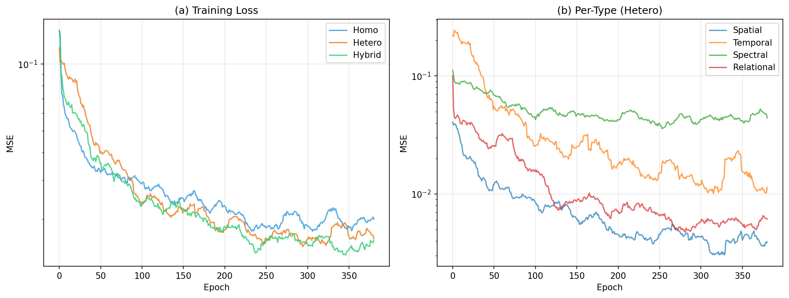
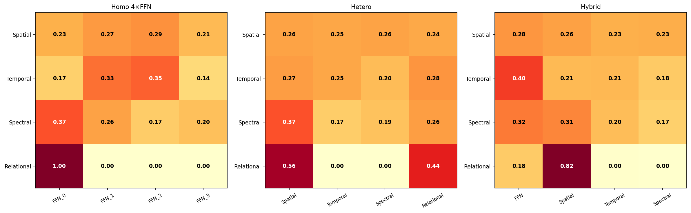
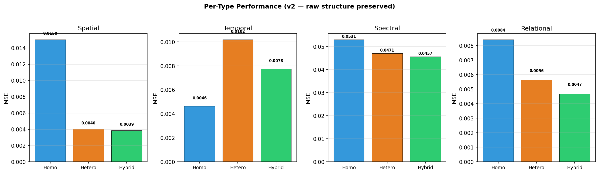
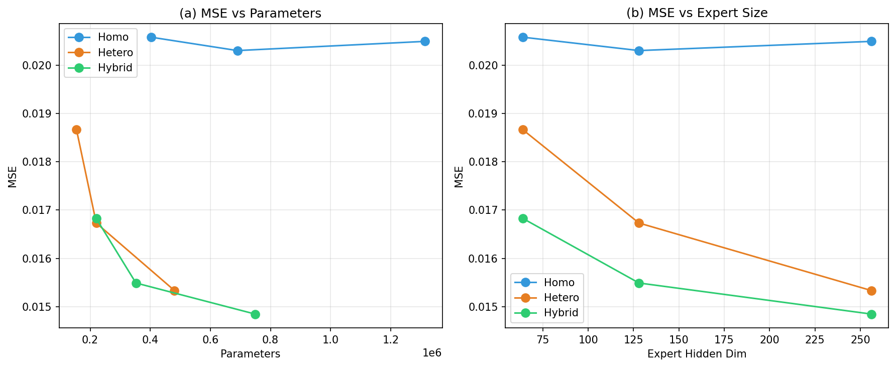
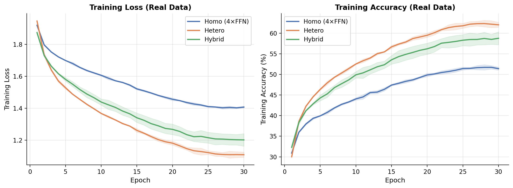
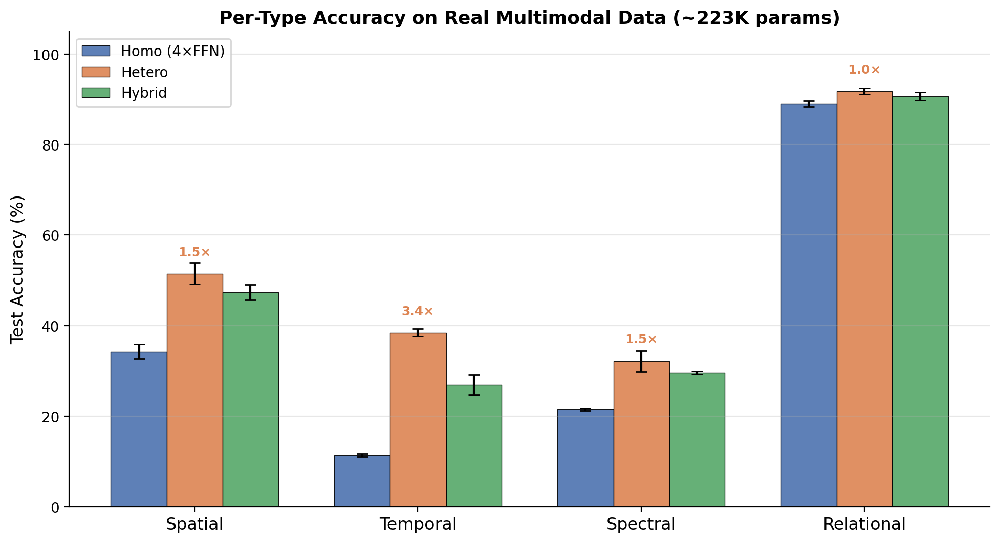
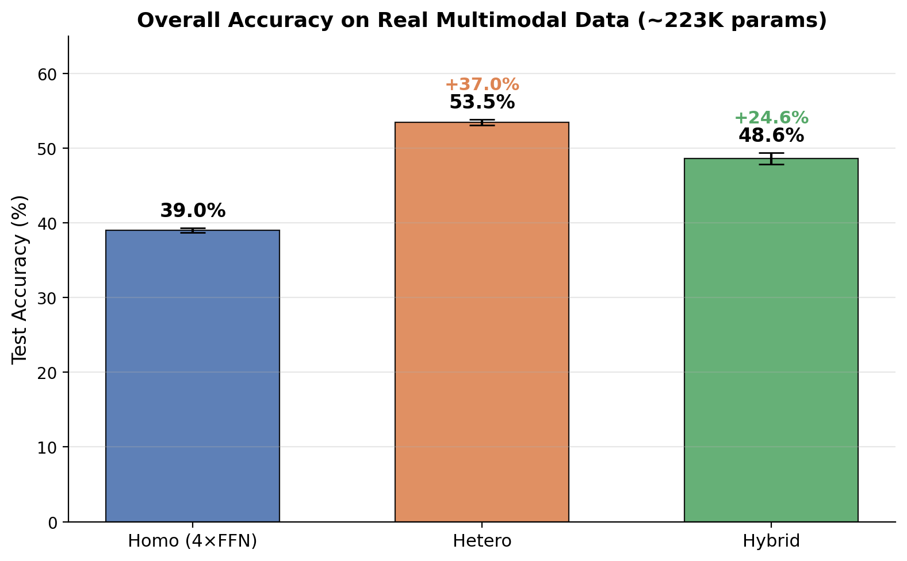
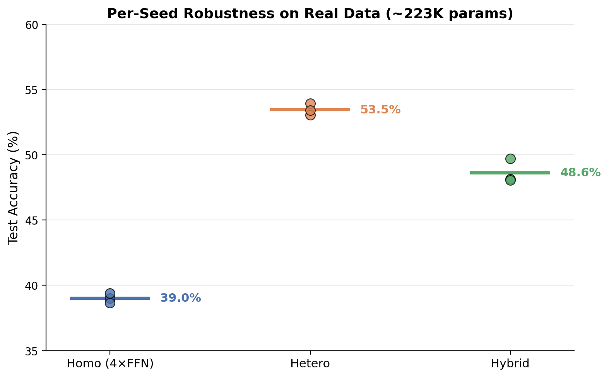
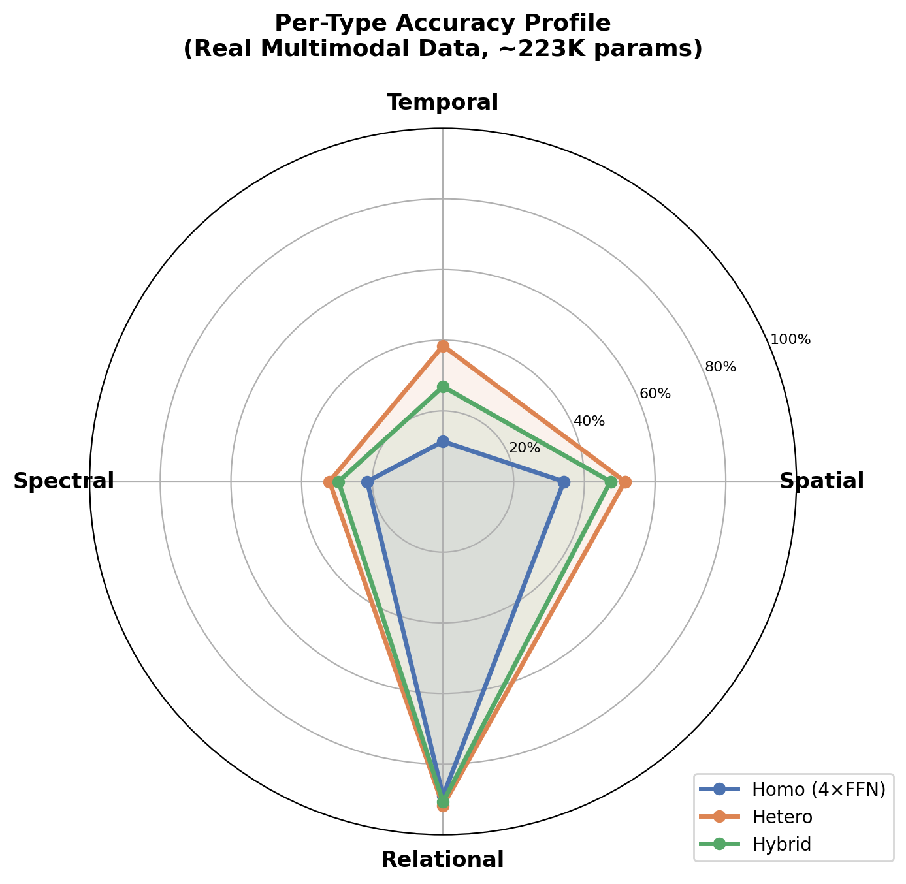
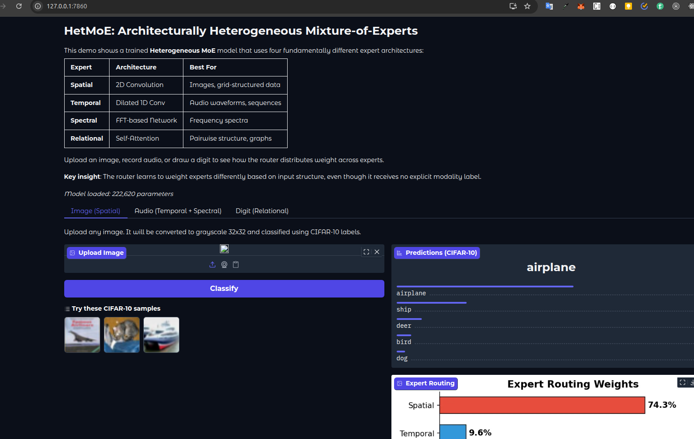

# Architectural Heterogeneity in Mixture-of-Experts

**Representational Complementarity Without Routing Specialization**

*Surajbhan Satpathy — [Yoctotta Technologies](https://yoctotta.com), Bhubaneswar, India*

## Overview

Standard Mixture-of-Experts (MoE) architectures use identical FFN experts that differ only in learned weights. This project explores **architecture-type heterogeneous MoE**, where each expert uses a fundamentally different computational primitive:

| Expert | Architecture | Inductive Bias |
|--------|-------------|----------------|
| Spatial | 2D Convolution | Grid-structured data |
| Temporal | Dilated Causal 1D Conv | Multi-scale sequences |
| Spectral | FFT-based Network | Frequency-domain analysis |
| Relational | Self-Attention | Pairwise structure |

## Key Results

### Synthetic Experiments (Structured Regression)

Parameter-matched comparison at three budget levels (368K, 530K, 690K params):

- Heterogeneous MoE achieves **16-32% lower error** than homogeneous MoE at every budget
- Homogeneous MoE exhibits **early saturation**: nearly doubling parameters (368K to 690K) yields zero improvement (0.0185 &rarr; 0.0201)
- Heterogeneous MoE **improves steadily** across the same range (0.0155 &rarr; 0.0142)
- Results robust across 5 random seeds (p < 0.01)

#### Training Loss & Per-Expert Breakdown


#### Routing Weights Across Architectures


#### Per-Type Performance (MSE)


#### Scaling Behavior


### Real-Data Experiments (CIFAR-10, Speech Commands, MNIST)

At matched parameter budgets (~223K params):

| Model | Accuracy | Params |
|-------|----------|--------|
| Homogeneous (4x FFN) | 39.0% | 223,408 |
| **Heterogeneous** | **53.5%** | 222,620 |
| Hybrid (1 FFN + 3 specialized) | 48.6% | 223,980 |

**+37.0% improvement** from heterogeneous over homogeneous at matched parameters.

#### Training Curves (Real Data)


#### Per-Type Accuracy


#### Overall Accuracy Comparison


#### Seed Robustness


#### Per-Type Accuracy Profile (Radar)


## Interactive Demo

Try the model yourself — upload an image, record audio, or draw a digit and watch the router distribute weight across architecturally diverse experts in real time.



*The Spatial (2D-CNN) expert receives 74.3% of routing weight for an airplane image — without any explicit modality label.*

```bash
python app.py  # Launch locally at http://localhost:7860
```

Also available on [HuggingFace Spaces](https://huggingface.co/spaces/surajbhan/hetmoe).

## Repository Structure

```
hetmoe_v2.py                  # Synthetic experiments (structured regression)
hetmoe_realdata.py            # Real-data experiments (CIFAR-10, Speech Commands, MNIST)
hetmoe_fairness_audit.py      # Fairness audit across expert types
app.py                        # Gradio interactive demo
deploy_hf.sh                  # Deploy to HuggingFace Spaces
hetmoe_paper.tex              # Research paper (LaTeX source)
hetmoe_paper.pdf              # Compiled paper
hetmoe_v2_results/            # Synthetic experiment results and figures
hetmoe_realdata_results/      # Real-data results, training curves, figures, and model weights
hetmoe_audit/                 # Fairness audit results
```

## Requirements

- Python 3.8+
- PyTorch 2.0+
- torchvision
- torchaudio
- matplotlib
- numpy

```bash
pip install torch torchvision torchaudio matplotlib numpy
```

## Usage

### Synthetic Experiments

```bash
python hetmoe_v2.py
```

Runs the full synthetic benchmark: core comparison, parameter-matched scaling, seed robustness, and ablation studies. Results and figures are saved to `hetmoe_v2_results/`.

### Real-Data Experiments

```bash
python hetmoe_realdata.py
```

Downloads CIFAR-10, Speech Commands, and MNIST, then trains homogeneous, heterogeneous, and hybrid MoE models across 3 seeds. Generates training curves and comparison figures in `hetmoe_realdata_results/`.

Datasets are cached in `data_cache/` (auto-downloaded on first run).

### Interactive Demo (Local)

```bash
pip install gradio scipy
python app.py
```

Opens at `http://localhost:7860`. Requires trained model weights — run `hetmoe_realdata.py` first.

### Deploy to HuggingFace Spaces

```bash
# One-command deploy (requires huggingface-cli login)
bash deploy_hf.sh
```

Or manually: see `deploy_hf.sh` for step-by-step instructions.

### Fairness Audit

```bash
python hetmoe_fairness_audit.py
```

Evaluates per-expert-type performance disparities and routing fairness. Results saved to `hetmoe_audit/`.

## Hardware

Experiments were run on an NVIDIA GeForce GTX 1650 (4 GB VRAM). The synthetic experiment takes ~30 minutes; real-data experiments take ~10 minutes.

## Citation

If you use this work, please cite:

```bibtex
@article{satpathy2026hetmoe,
  title={Architectural Heterogeneity in Mixture-of-Experts: Representational Complementarity Without Routing Specialization},
  author={Satpathy, Surajbhan},
  year={2026}
}
```

## AI Assistance Disclosure

- **Idea and experimental design**: Surajbhan Satpathy
- **Code implementation and paper drafting**: Assisted by Claude (Anthropic)
- **Paper review and critique**: ChatGPT (OpenAI)

All AI outputs were reviewed, validated, and edited by the author.

## License

MIT
